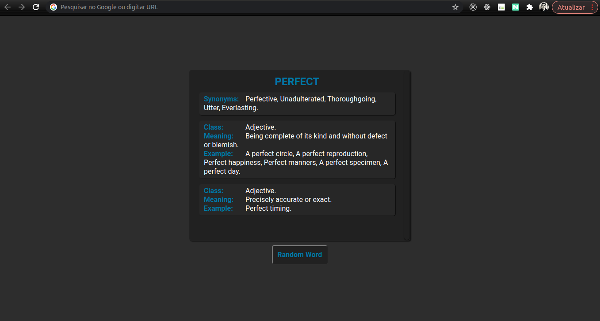

# RandomWordChromeExtension

* Application in chrome extension format for studying english.
* When a new browser tab is opened, the application brings a word randomly from the English vocabulary with its meanings, synonyms, contexts, antonym and examples.

* <a href="https://webkul.com/blog/how-to-install-the-unpacked-extension-in-chrome/" target="_blank" >How to install the unpacked extension in Chrome</a>.

<kbd></kbd>

<kbd></kbd>